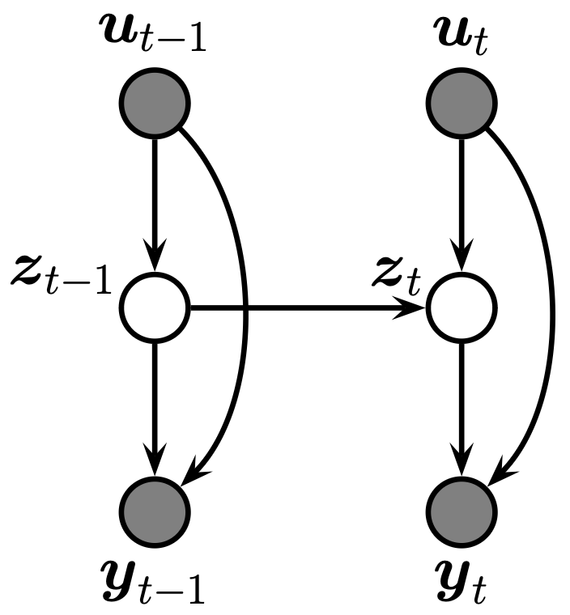

---
tags:
  - ssm
  - ml
  - bayesian
folder: ssm
title: state space model
date created: Sunday, February 11th 2024, 8:33:45 pm
date modified: Sunday, February 25th 2024, 7:58:59 pm
share: true
---

A state space model is a partially observed **Markov model**:

- $\mathbf{z}_t$ are the latent **states**
- $\mathbf{y}_t$ are the **observations**
- $\mathbf{u}_t$ are exogenous inputs

Using the Markov property, the above probabilistic graphical model forms the joint distribution

$$p(\mathbf{y}_{1:T}, \mathbf{z}_{1:T} | \mathbf{u}_{1:T}) = [p(\mathbf{z}_1| \mathbf{u}_{1)}\prod_i^T\underbrace{p(\mathbf{z}_t| \mathbf{z}_{t-1}, \mathbf{u}_t)}_{\text{dynamics model}}][\prod_i^T\underbrace{p(\mathbf{y}_t| \mathbf{z}_t, \mathbf{u}_t)}_{\text{observation model}}]$$

When the dynamics model is categorical so that we have discrete latent states, then we have [hidden Markov models](https://probml.github.io/dynamax/notebooks/hmm/casino_hmm_inference.html).

When the **dynamics model** and the **observation model** are Gaussian, we have a [[./linear gaussian ssm|linear gaussian ssm]], which can be efficiently solved using [[./kalman filtering and smoothing|kalman filtering and smoothing]].

*See [[./ssm resources|ssm resources]]*.
